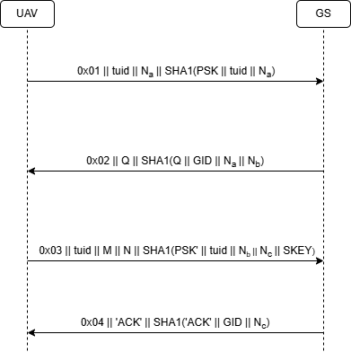

# MaDrones Protocol [_snakeCTF 2025 Finals_]

**Category**: crypto\
**Author**: Doc

## Description

Checkout our new protocol for secure drones communications.

## Solution

The challenge provides two golang binaries compiled for RISC-V: an UAV and a ground station implementing the security protocol for drones SecAuthUAV, and a pcap with the packets exchanged between two UAVs and the ground station.

Once the protocol flow between the UAVs and the GS has been reconstructed, the pcap can be organized in the following way:
 * Session establishment between UAV 1 and GS (packets 1, 3, 6, 8)
 * Session establishment between UAV 2 and GS (packets 2, 4, 5, 7)
 * UAV 1 request the GS to establish a session key with UAV 2 (packet 9)
 * GS provides session key to the UAVs (packets 10, 11)
 * UAVs exchange flag's halves (packets 12, 13)

 The goal is to recover the session key established between one of the UAVs and the GS, which is later used to encrypt the UAV-UAV session key, and then decrypt the messges containing the flag's parts.

#### Recovering UAV-GS session key
The first step is to recover the session key established between one of the UAVs and the GS. The follwoing figure shows the messages exchanged during this phase.



The first message containes the temporary identity $tuid$ and a nonce $N_A$, along with an hash. The GS answers with a message containing a value $Q$ computed as follows:
```math
\begin{align*}
X_1 &= N_A \oplus K_2\\
Y_2 &= N_B \oplus X_1 \oplus K_1\\
Q &= (Y_2 \| X_1) \oplus (K_2 \| K_1)
\end{align*}
```
where $N_B$ is a nonce. while $K_1$ and $K_2$ are the two halves of the pre-shared secret between the GS and the UAV. Since $Y_2$, $X_1$, $K_1$ and $K_2$ all have the same length, it is possible to rewrite $Q$ in the follwoing way
```math
\begin{align*}
Q &= (Y_2 \oplus K_2) \| (X_1 \oplus K_1)\\
  &= (N_B \oplus X_1 \oplus K_1  \oplus K_2) \| (N_A \oplus K_2 \oplus K_1)\\
  &= (N_B \oplus N_A \oplus K_2 \oplus K_1  \oplus K_2) \| (N_A \oplus K_2 \oplus K_1)\\
  &= (N_B \oplus N_A \oplus K_1 ) \| (N_A \oplus K_2 \oplus K_1)
\end{align*}
```

The third message contains the terms $M$ and $N$, computed as
```math
\begin{align*}
&M = D \oplus (K_2 \| K_1)\\
&N = N_C \oplus K_1
\end{align*}
```
where $N_C$ is a nonce and $D$ is the SHA3-384 digest of $K_1||K_2||N_C$ truncated to the first 256 bits.

The shared secret on which the UAV and the GS agree is computed as
```math
S = (K_1 \oplus N_B) \| (K_2 \oplus N_C) 
```
and the session key is the SHA3-224 of the shared secret truncated to the first 128 bits.

The first half of the shared secret can be obtained by XOR-ing the first half of the term $Q$ with the nonce $N_A$. The other part of the shared secret can be computed by XOR-ing the second half $Q$ with the term $N$ and the nonce $N_A$
```math
\begin{align*}
(N_A \oplus K_2 \oplus K_1) \oplus N_A \oplus N &= K_2 \oplus K_1 \oplus N_C \oplus K_1\\
& = K_2 \oplus N_C
\end{align*}
```

#### Recovering the flag
The UAV-GS session keys are used by the GS to encrypt the UAV-UAV session key, which is sent to the UAVs in messages 10 and 11 of the pcap. Using the UAV-GS session key just retrieved it is possible to obtain the UAV-UAV session key and decrypt the payload of the UDP datagrams in the last two packets of the pcap, which contain the two halves of the flag encrypted using AES in CBC mode.

The solver's code can be found [here](./attachments/solve.py).
