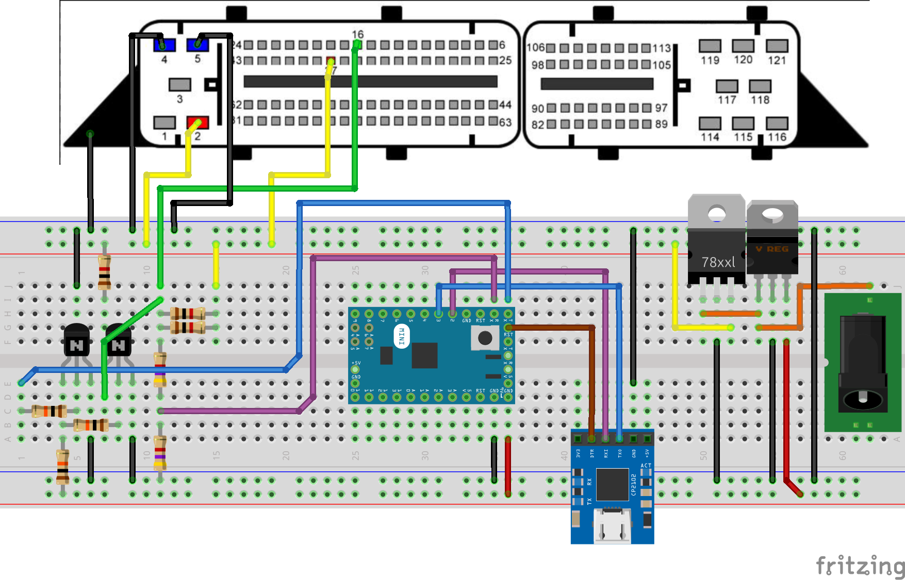

# Racing [_snakeCTF 2025 Finals_]

**Category**: hardware

## Description

XXX: Don't you think it's unusual that no one has solved last year's ECU challenge?
YYY: Yeah, maybe we should simplify it a bit.
XXX: Good idea, let's just give them the writeup directly.
YYY: Yeah, that would make a good baby challenge.

2 weeks later...

XXX: Are you sure you brought everything? Can you check the component list from the writeup again?
YYY: Yep, I have the ECUs, the cables, and... Ooooh....
XXX: Crap! Are you sure the challenge is still solvable?
YYY: I mean, it's technically still solvable, but you now need a phd in electronic enginnering to sol...
XXX: Say no more. Let's strip the baby tag and keep it. It will be fun.
YYY: I don't think so. It's so easy to brick the ECU or blow up a component. One wrong connection and puff, it's unsolvable.
XXX: That's part of the fun, right? I'm sure they know how to read a datasheet.

> With this challenge you are provided an ECU (Engine Control Unit), containing the flag. The ECU is placed on your table.
> Additional components can be rented for free at the hardware desk, placed near the staff desk.
> Components can be taken from the hardware desk, ONLY when SnakeCTF staff is present to register the component.
> In case none of the staff is present, and you need a component, you can go to the staff desk and ask for it, or open a ticket.
> Opening the ECU will not help you and is not recommended. If you want to do so regardless, make sure to do it safely as there is a high risk of injury due to sharp edges.

## Solution

