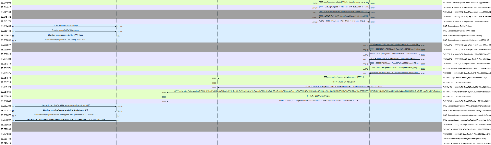

# microrealm [_snakeCTF 2025 Finals_]

**Category**: web \
**Author**: jotone

## Description

I've managed to infiltrate their network, but I wasn't able to hack their authentication system. Maybe you can help me out?

## Solution

### Analyse the website

The website is a simple barebone web application with the following pages:

- Login
- Register
- Profile
- Flag

The login and register pages are standard. The profile page allows a user to set a profile picture by providing a URL. The flag page is not accessible by a normal user.

### Analyse the attachments

#### Client side

Both the client and backend network captures have been provided. This is useful for correlating the requests made by the client with the requests between the frontend and backend services.

#### Backend side

In the initial packets, it is possible to observe that multiple services are running and communicating with each other using HTTP requests. In particular, a wayfinder service acts as a service discovery, with two services registered to it: buccaneer and treasure.

By analysing the endpoints of each host, their purpose can be understood:

- buccaneer: authentication service, allows users to be registered and logged in, and tokens to be verified.
- treasure: exposes an endpoint from which the flag can be obtained.
- wayfinder: service discovery, allows services to be registered or unregistered and other services to be discovered.

There are also two other services that are not registered to the service discovery:

- 172.20.0.3 (actual name of the service: harbor): web frontend, serves the web application and communicates with the API gateway.
- sloop (172.20.0.2, 172.19.0.5): API gateway, exposes the REST API endpoints and routes the requests to the appropriate backend services.

From the provided network capture, all the endpoints of the services can be extracted. Here are the most relevant ones:

- `wayfinder`
  - `register` - A service can be registered given its type, address and port.
  - `unregister` - A service can be unregistered given its type, address and port.
  - `get-service` - The address and port of a service can be retrieved given its type.
- `buccaneer`
  - `verify-token` - A JWT token can be verified and the user data returned.
  - `register` - A new user can be registered.
  - `login` - A user can be logged in and a JWT token returned.
- `treasure`
  - `get-flag` - The flag can be returned if the user is an admin.
- `sloop`
  - `set-user-photo` - The user photo can be set by fetching the provided URL.
  - `get-user-photo` - The user photo can be retrieved.
  - Various endpoints that proxy requests to the other backend services.
- `172.20.0.3`
  - Various endpoints that serve the web application and proxy requests to the sloop service.

Before the flag is returned, it can be observed that the flag service verifies the JWT token by calling the auth service. In the user data, the `is_admin` field can be seen.

Furthermore, it appears that the frontend service and the other backend services are running on two different network subnets. By analysing the flow of the requests, it can be observed that when the harbour service (172.20.0.3) makes a request to the sloop service (172.20.0.2), a series of requests are triggered from another IP address, 172.19.0.5, which also appears to belong to the sloop service. These requests are sent to the other backend services (buccaneer, treasure, wayfinder). This demonstrates that the harbour service does not communicate directly with the backend services. Instead, all requests are routed through the sloop service, which acts as an API gateway and is present on both subnets to facilitate this communication.

Additionally, the set user photo endpoint of the sloop service makes a request to the provided URL and the response is stored.

## Testing the SSRF

The set user photo functionality can be exploited to perform SSRF attacks. No validation is performed on the provided URL, and by providing a URL that points to the internal services, the frontend service can be made to send requests to them.

## Exploiting

The SSRF vulnerability can be exploited to make the frontend service call the service discovery service and obtain the address of the auth service. Subsequently, a custom auth service can be registered that will return a JWT token with the `is_admin` field set to true. After this, the backend auth service can be unregistered to force the flag service to call the custom auth service.

The solver script can be found at [attachments/solve.py](attachments/solve.py).
